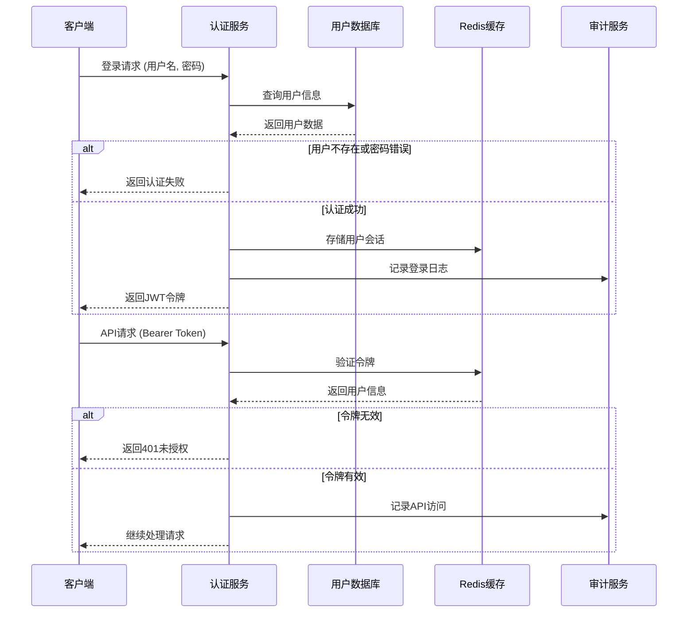

# 后端架构

## 服务架构

基于Express.js的传统服务器架构，采用MVC模式和分层设计。

### 控制器/路由组织

```
src/
├── controllers/          # 控制器层
│   ├── authController.ts
│   ├── userController.ts
│   ├── courseController.ts
│   ├── selectionController.ts
│   └── statisticsController.ts
├── services/            # 业务逻辑层
│   ├── authService.ts
│   ├── userService.ts
│   ├── courseService.ts
│   ├── selectionService.ts
│   └── statisticsService.ts
├── models/              # 数据模型层
│   ├── User.ts
│   ├── Course.ts
│   ├── Selection.ts
│   └── AuditLog.ts
├── middleware/          # 中间件
│   ├── auth.ts
│   ├── validation.ts
│   ├── errorHandler.ts
│   └── rateLimiter.ts
├── routes/              # 路由定义
│   ├── auth.ts
│   ├── users.ts
│   ├── courses.ts
│   ├── selections.ts
│   └── statistics.ts
├── utils/               # 工具函数
│   ├── database.ts
│   ├── redis.ts
│   ├── logger.ts
│   └── helpers.ts
├── config/              # 配置文件
│   ├── database.ts
│   ├── redis.ts
│   └── app.ts
├── types/               # 类型定义
│   ├── auth.ts
│   ├── user.ts
│   └── course.ts
└── tests/               # 测试文件
    ├── controllers/
    ├── services/
    └── utils/
```

### 控制器模板

```typescript
import { Request, Response, NextFunction } from 'express';
import { CourseService } from '../services/courseService';
import { CreateCourseRequest, UpdateCourseRequest } from '../types/course';
import { ApiResponse } from '../utils/response';

export class CourseController {
  private courseService: CourseService;

  constructor() {
    this.courseService = new CourseService();
  }

  // 获取课程列表
  public getCourses = async (req: Request, res: Response, next: NextFunction) => {
    try {
      const { page = 1, limit = 20, search, teacher, credits, status } = req.query;

      const filters = {
        search: search as string,
        teacher: teacher as string,
        credits: credits ? parseInt(credits as string) : undefined,
        status: status as string,
      };

      const result = await this.courseService.getCourses(
        filters,
        parseInt(page as string),
        parseInt(limit as string)
      );

      return ApiResponse.success(res, result, '获取课程列表成功');
    } catch (error) {
      next(error);
    }
  };

  // 获取课程详情
  public getCourse = async (req: Request, res: Response, next: NextFunction) => {
    try {
      const { courseId } = req.params;
      const course = await this.courseService.getCourseById(courseId);

      if (!course) {
        return ApiResponse.notFound(res, '课程不存在');
      }

      return ApiResponse.success(res, { course }, '获取课程详情成功');
    } catch (error) {
      next(error);
    }
  };

  // 创建课程
  public createCourse = async (req: Request, res: Response, next: NextFunction) => {
    try {
      const courseData: CreateCourseRequest = req.body;
      const course = await this.courseService.createCourse(courseData);

      return ApiResponse.created(res, { course }, '创建课程成功');
    } catch (error) {
      next(error);
    }
  };

  // 更新课程
  public updateCourse = async (req: Request, res: Response, next: NextFunction) => {
    try {
      const { courseId } = req.params;
      const courseData: UpdateCourseRequest = req.body;
      const course = await this.courseService.updateCourse(courseId, courseData);

      return ApiResponse.success(res, { course }, '更新课程成功');
    } catch (error) {
      next(error);
    }
  };

  // 删除课程
  public deleteCourse = async (req: Request, res: Response, next: NextFunction) => {
    try {
      const { courseId } = req.params;
      await this.courseService.deleteCourse(courseId);

      return ApiResponse.success(res, null, '删除课程成功');
    } catch (error) {
      next(error);
    }
  };
}
```

## 数据库架构

### 模式设计

使用TypeORM作为ORM，定义实体模型和关系映射：

```typescript
import { Entity, PrimaryGeneratedColumn, Column, CreateDateColumn, UpdateDateColumn, OneToMany, ManyToOne } from 'typeorm';
import { Selection } from './Selection';

@Entity('courses')
export class Course {
  @PrimaryGeneratedColumn('uuid')
  id: string;

  @Column({ unique: true, length: 20 })
  code: string;

  @Column({ length: 200 })
  name: string;

  @Column('text', { nullable: true })
  description: string;

  @Column('tinyint', { unsigned: true })
  credits: number;

  @Column({ length: 100 })
  teacher: string;

  @Column('smallint', { unsigned: true })
  capacity: number;

  @Column('smallint', { unsigned: true, default: 0 })
  enrolled: number;

  @Column({
    type: 'enum',
    enum: ['draft', 'published', 'cancelled', 'completed'],
    default: 'draft'
  })
  status: string;

  @OneToMany(() => Selection, selection => selection.course)
  selections: Selection[];

  @CreateDateColumn()
  createdAt: Date;

  @UpdateDateColumn()
  updatedAt: Date;
}
```

### 数据访问层

```typescript
import { AppDataSource } from '../config/database';
import { Course } from '../models/Course';
import { Repository, Like, FindOptionsWhere } from 'typeorm';
import { CreateCourseRequest, UpdateCourseRequest, CourseFilters } from '../types/course';

export class CourseRepository {
  private repository: Repository<Course>;

  constructor() {
    this.repository = AppDataSource.getRepository(Course);
  }

  async create(courseData: CreateCourseRequest): Promise<Course> {
    const course = this.repository.create(courseData);
    return await this.repository.save(course);
  }

  async findById(id: string): Promise<Course | null> {
    return await this.repository.findOne({
      where: { id },
      relations: ['schedules'],
    });
  }

  async findByCode(code: string): Promise<Course | null> {
    return await this.repository.findOne({
      where: { code },
    });
  }

  async findWithFilters(
    filters: CourseFilters,
    page: number,
    limit: number
  ): Promise<{ courses: Course[]; total: number }> {
    const where: FindOptionsWhere<Course> = {};

    if (filters.search) {
      where.name = Like(`%${filters.search}%`);
    }

    if (filters.teacher) {
      where.teacher = filters.teacher;
    }

    if (filters.credits) {
      where.credits = filters.credits;
    }

    if (filters.status) {
      where.status = filters.status;
    }

    const [courses, total] = await this.repository.findAndCount({
      where,
      relations: ['schedules'],
      skip: (page - 1) * limit,
      take: limit,
      order: {
        createdAt: 'DESC',
      },
    });

    return { courses, total };
  }

  async update(id: string, courseData: UpdateCourseRequest): Promise<Course> {
    await this.repository.update(id, courseData);
    const course = await this.findById(id);
    if (!course) {
      throw new Error('课程不存在');
    }
    return course;
  }

  async delete(id: string): Promise<void> {
    await this.repository.delete(id);
  }

  async incrementEnrolled(id: string): Promise<void> {
    await this.repository.increment({ id }, 'enrolled', 1);
  }

  async decrementEnrolled(id: string): Promise<void> {
    await this.repository.decrement({ id }, 'enrolled', 1);
  }
}
```

## 身份认证和授权架构

### 认证流程



### 中间件/守卫

```typescript
import { Request, Response, NextFunction } from 'express';
import jwt from 'jsonwebtoken';
import { ApiResponse } from '../utils/response';
import { UserService } from '../services/userService';

interface AuthenticatedRequest extends Request {
  user?: any;
}

export const authMiddleware = async (
  req: AuthenticatedRequest,
  res: Response,
  next: NextFunction
) => {
  try {
    const token = req.headers.authorization?.replace('Bearer ', '');

    if (!token) {
      return ApiResponse.unauthorized(res, '缺少认证令牌');
    }

    const decoded = jwt.verify(token, process.env.JWT_SECRET!) as any;
    const userService = new UserService();
    const user = await userService.findById(decoded.userId);

    if (!user || user.status !== 'active') {
      return ApiResponse.unauthorized(res, '用户不存在或已被禁用');
    }

    req.user = user;
    next();
  } catch (error) {
    return ApiResponse.unauthorized(res, '无效的认证令牌');
  }
};

export const requireRole = (roles: string[]) => {
  return (req: AuthenticatedRequest, res: Response, next: NextFunction) => {
    if (!req.user) {
      return ApiResponse.unauthorized(res, '用户未认证');
    }

    if (!roles.includes(req.user.role)) {
      return ApiResponse.forbidden(res, '权限不足');
    }

    next();
  };
};
```
