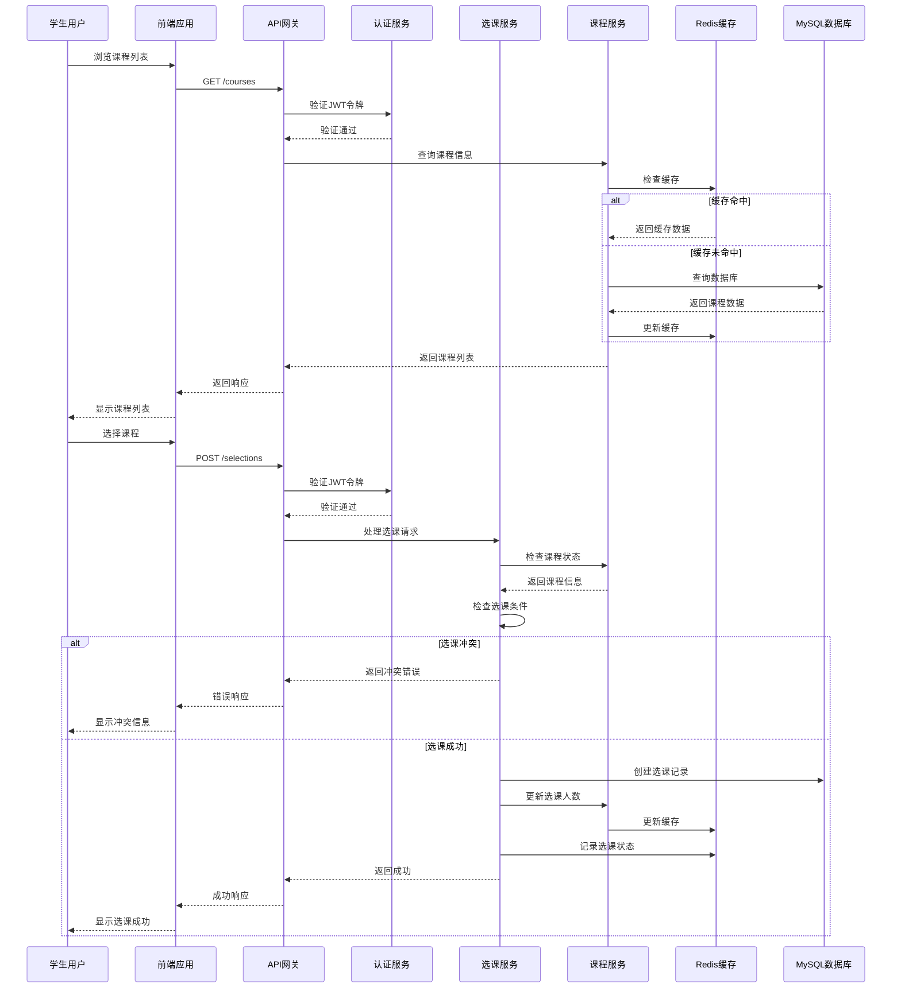
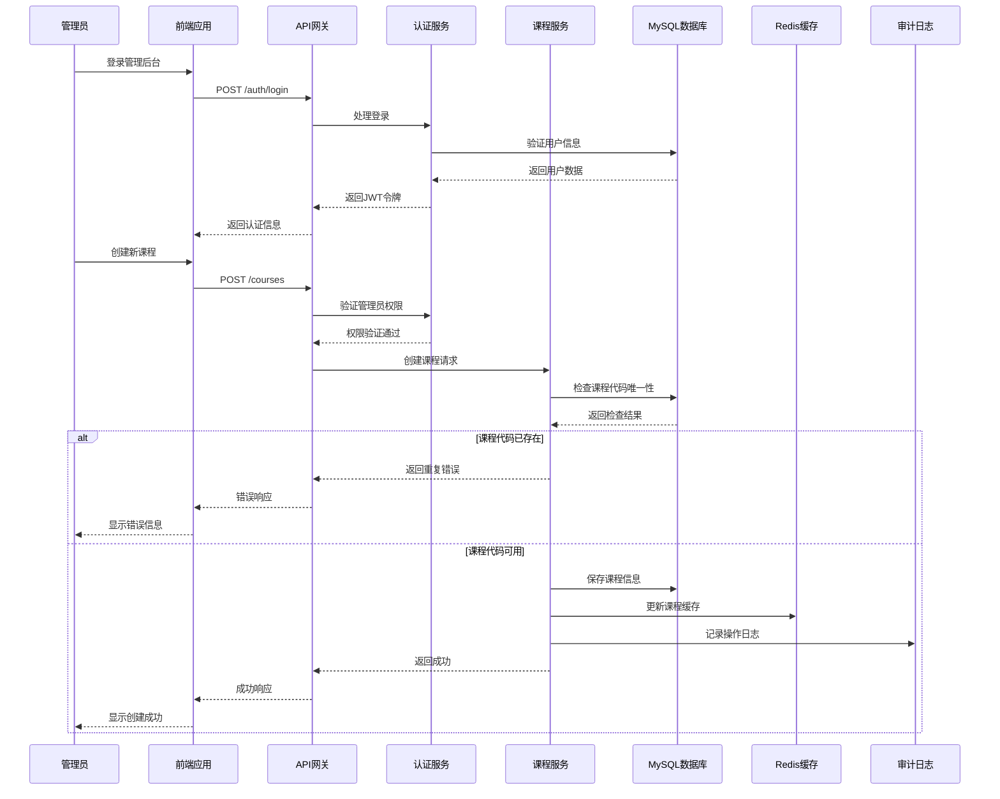

# 核心工作流

## 学生选课工作流

```mermaid
sequenceDiagram
    participant Student as 学生用户
    participant Frontend as 前端应用
    participant Gateway as API网关
    participant Auth as 认证服务
    participant Select as 选课服务
    participant Course as 课程服务
    participant Redis as Redis缓存
    participant DB as MySQL数据库

    Student->>Frontend: 浏览课程列表
    Frontend->>Gateway: GET /courses
    Gateway->>Auth: 验证JWT令牌
    Auth-->>Gateway: 验证通过
    Gateway->>Course: 查询课程信息
    Course->>Redis: 检查缓存
    alt 缓存命中
        Redis-->>Course: 返回缓存数据
    else 缓存未命中
        Course->>DB: 查询数据库
        DB-->>Course: 返回课程数据
        Course->>Redis: 更新缓存
    end
    Course-->>Gateway: 返回课程列表
    Gateway-->>Frontend: 返回响应
    Frontend-->>Student: 显示课程列表

    Student->>Frontend: 选择课程
    Frontend->>Gateway: POST /selections
    Gateway->>Auth: 验证JWT令牌
    Auth-->>Gateway: 验证通过
    Gateway->>Select: 处理选课请求

    Select->>Course: 检查课程状态
    Course-->>Select: 返回课程信息
    Select->>Select: 检查选课条件

    alt 选课冲突
        Select-->>Gateway: 返回冲突错误
        Gateway-->>Frontend: 错误响应
        Frontend-->>Student: 显示冲突信息
    else 选课成功
        Select->>DB: 创建选课记录
        Select->>Course: 更新选课人数
        Course->>Redis: 更新缓存
        Select->>Redis: 记录选课状态
        Select-->>Gateway: 返回成功
        Gateway-->>Frontend: 成功响应
        Frontend-->>Student: 显示选课成功
    end
```

## 管理员课程管理工作流

```mermaid
sequenceDiagram
    participant Admin as 管理员
    participant Frontend as 前端应用
    participant Gateway as API网关
    participant Auth as 认证服务
    participant Course as 课程服务
    participant DB as MySQL数据库
    participant Cache as Redis缓存
    participant Audit as 审计日志

    Admin->>Frontend: 登录管理后台
    Frontend->>Gateway: POST /auth/login
    Gateway->>Auth: 处理登录
    Auth->>DB: 验证用户信息
    DB-->>Auth: 返回用户数据
    Auth-->>Gateway: 返回JWT令牌
    Gateway-->>Frontend: 返回认证信息

    Admin->>Frontend: 创建新课程
    Frontend->>Gateway: POST /courses
    Gateway->>Auth: 验证管理员权限
    Auth-->>Gateway: 权限验证通过
    Gateway->>Course: 创建课程请求

    Course->>DB: 检查课程代码唯一性
    DB-->>Course: 返回检查结果

    alt 课程代码已存在
        Course-->>Gateway: 返回重复错误
        Gateway-->>Frontend: 错误响应
        Frontend-->>Admin: 显示错误信息
    else 课程代码可用
        Course->>DB: 保存课程信息
        Course->>Cache: 更新课程缓存
        Course->>Audit: 记录操作日志
        Course-->>Gateway: 返回成功
        Gateway-->>Frontend: 成功响应
        Frontend-->>Admin: 显示创建成功
    end
```
