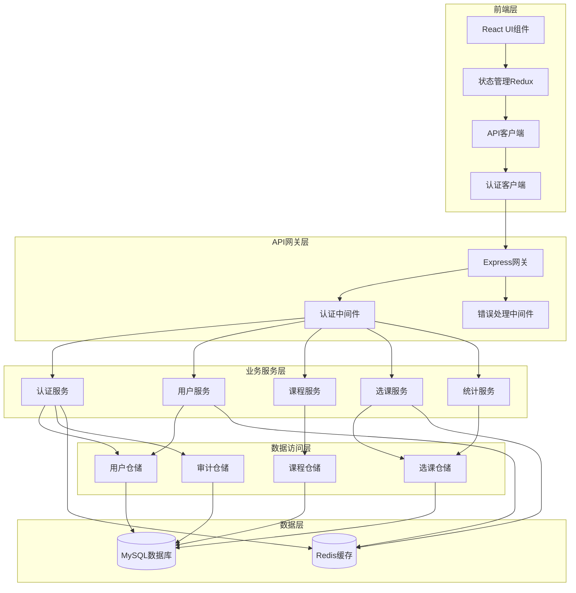

# 组件

## 认证组件

**职责:** 处理用户身份认证和授权，包括登录、注册、令牌管理和权限验证

**关键接口:**
- 用户登录/登出
- JWT令牌生成和验证
- 权限检查中间件
- 密码加密和验证

**依赖:** Redis缓存、用户数据库

**技术栈:** Node.js + Express + JWT + Bcrypt + Redis

## 用户管理组件

**职责:** 管理用户基本信息、用户资料和用户状态

**关键接口:**
- 用户CRUD操作
- 用户信息查询和更新
- 用户状态管理
- 密码重置

**依赖:** 认证组件、数据库

**技术栈:** Express + TypeORM + MySQL + 验证中间件

## 课程管理组件

**职责:** 管理课程信息、课程状态和课程数据

**关键接口:**
- 课程CRUD操作
- 课程查询和筛选
- 课程状态管理
- 课程数据导入导出

**依赖:** 用户管理组件、数据库

**技术栈:** Express + TypeORM + MySQL + Excel处理库

## 选课服务组件

**职责:** 处理学生选课业务逻辑、选课冲突检测和选课状态管理

**关键接口:**
- 选课/退课操作
- 选课冲突检测
- 选课名额管理
- 选课历史记录

**依赖:** 认证组件、课程管理组件、用户管理组件

**技术栈:** Express + TypeORM + Redis + 事务管理

## 数据统计组件

**职责:** 提供系统数据统计、报表生成和数据分析功能

**关键接口:**
- 系统概览统计
- 课程选课统计
- 用户行为分析
- 报表导出

**依赖:** 选课服务组件、课程管理组件

**技术栈:** Express + 数据聚合库 + 图表生成库

## 前端API客户端组件

**职责:** 处理前端与后端API通信，包括请求拦截、响应处理和错误处理

**关键接口:**
- HTTP请求封装
- 认证令牌管理
- 请求/响应拦截器
- 错误处理和重试

**依赖:** 认证组件

**技术栈:** Axios + TypeScript + React Context

## 状态管理组件

**职责:** 管理前端应用状态，包括用户状态、课程数据和UI状态

**关键接口:**
- 全局状态管理
- 状态持久化
- 状态订阅和更新
- 中间件支持

**依赖:** API客户端组件

**技术栈:** Redux Toolkit + RTK Query + TypeScript

## 组件图

