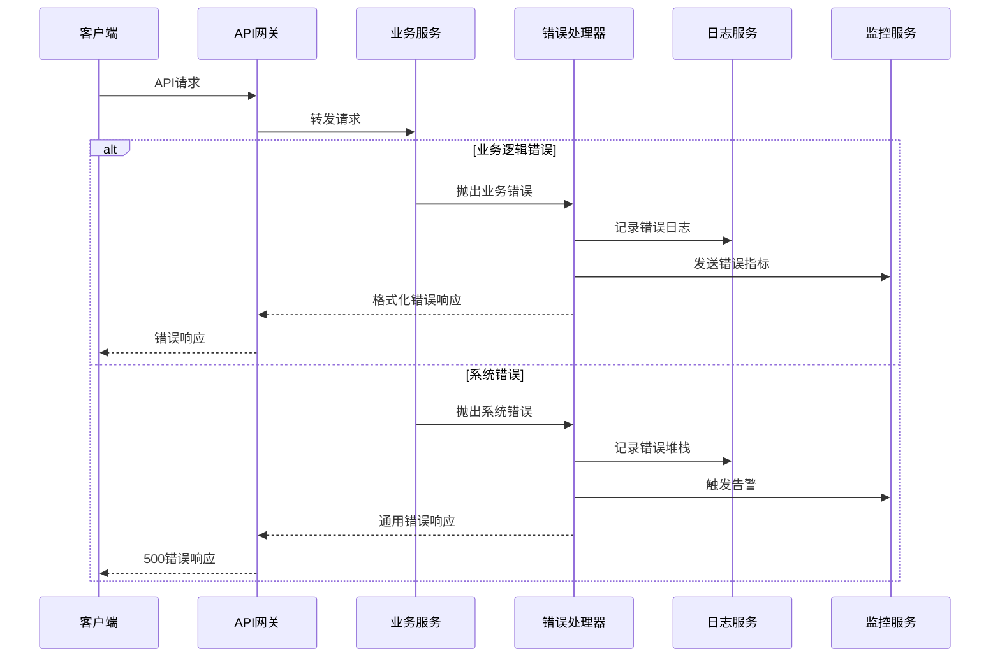

# 错误处理策略

## 错误流



## 错误响应格式

```typescript
interface ApiError {
  error: {
    code: string;
    message: string;
    details?: Record<string, any>;
    timestamp: string;
    requestId: string;
  };
}
```

## 前端错误处理

```typescript
import { createSlice, PayloadAction } from '@reduxjs/toolkit';

interface ErrorState {
  currentError: ApiError | null;
  errorHistory: ApiError[];
}

const errorSlice = createSlice({
  name: 'error',
  initialState: {
    currentError: null,
    errorHistory: [],
  } as ErrorState,
  reducers: {
    setError: (state, action: PayloadAction<ApiError>) => {
      state.currentError = action.payload;
      state.errorHistory.push(action.payload);

      // 只保留最近50个错误
      if (state.errorHistory.length > 50) {
        state.errorHistory.shift();
      }
    },
    clearError: (state) => {
      state.currentError = null;
    },
  },
});

export const { setError, clearError } = errorSlice.actions;
```

## 后端错误处理

```typescript
import { Request, Response, NextFunction } from 'express';
import { logger } from '../utils/logger';
import { ApiResponse } from '../utils/response';

export interface AppError extends Error {
  statusCode: number;
  code: string;
  details?: Record<string, any>;
  isOperational: boolean;
}

export class CustomError extends Error implements AppError {
  statusCode: number;
  code: string;
  details?: Record<string, any>;
  isOperational: boolean;

  constructor(message: string, statusCode: number, code: string, details?: Record<string, any>) {
    super(message);
    this.statusCode = statusCode;
    this.code = code;
    this.details = details;
    this.isOperational = true;

    Error.captureStackTrace(this, this.constructor);
  }
}

export const errorHandler = (
  error: AppError,
  req: Request,
  res: Response,
  next: NextFunction
) => {
  let { statusCode = 500, message, code = 'INTERNAL_ERROR', details } = error;

  // 记录错误日志
  logger.error({
    message: error.message,
    stack: error.stack,
    code,
    details,
    requestId: req.headers['x-request-id'],
    method: req.method,
    url: req.url,
    userAgent: req.headers['user-agent'],
    ip: req.ip,
  });

  // 开发环境返回堆栈信息
  if (process.env.NODE_ENV === 'development') {
    details = { ...details, stack: error.stack };
  }

  // 返回标准错误响应
  return ApiResponse.error(res, code, message, statusCode, details);
};

export const notFoundHandler = (req: Request, res: Response) => {
  return ApiResponse.notFound(res, '请求的资源不存在');
};
```
