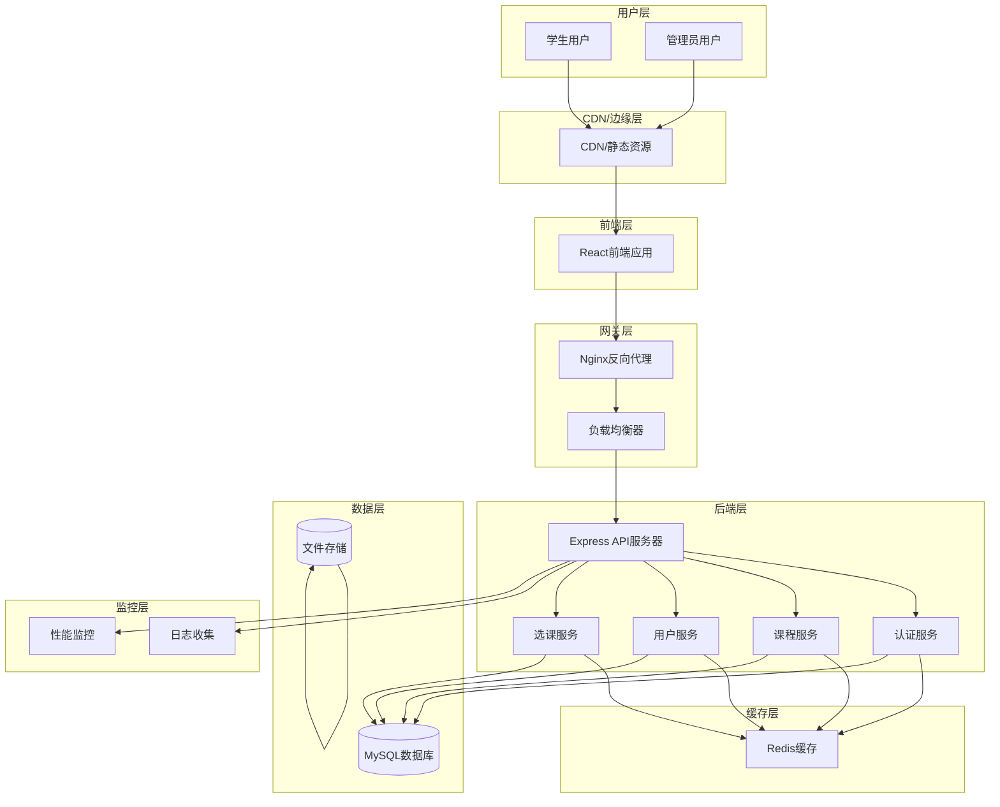

# 高级架构

## 技术摘要

本系统采用前后端分离的Monorepo架构，使用React + TypeScript前端和Node.js + Express后端，配合MySQL数据库和Redis缓存。整体架构采用分层设计，支持水平扩展和微服务演进。系统基于JWT的身份认证，RESTful API设计，并通过Nginx反向代理和CDN优化性能。架构设计优先考虑用户体验，从用户旅程出发反向推导技术实现，确保系统在选课高峰期能够处理高并发访问。

## 平台和基础设施选择

**平台:** 自托管云基础设施（支持阿里云/腾讯云/AWS）
**关键服务:**
- 前端: Vercel/Netlify 静态托管
- 后端: Docker容器化部署
- 数据库: MySQL 8.0 RDS + Redis 集群
- 文件存储: 对象存储服务
- 监控: 云监控服务 + 日志服务

**部署主机和区域:** 主要部署在华东区域，支持多可用区高可用

## 仓库结构

**结构:** Monorepo（单仓库）
**Monorepo工具:** Turborepo + npm workspaces
**包组织策略:**
- apps/: 应用程序包（前端和后端）
- packages/: 共享包（类型定义、UI组件、工具函数）
- docs/: 文档
- infrastructure/: 基础设施代码

## 高级架构图

## 架构模式

- **前后端分离架构:** React SPA + Express RESTful API - _理由:_ 独立开发部署，提升开发效率和系统可维护性
- **组件化UI:** 可复用React组件与TypeScript - _理由:_ 提升代码复用性，确保大型代码库的可维护性和类型安全
- **仓库模式:** 抽象数据访问逻辑 - _理由:_ 支持测试和未来数据库迁移的灵活性
- **API网关模式:** 所有API调用的单一入口点 - _理由:_ 集中化的认证、速率限制和监控
- **CQRS模式:** 读写分离的数据处理 - _理由:_ 优化高并发选课场景下的性能和一致性
- **事件驱动架构:** 基于事件的系统组件通信 - _理由:_ 提高系统解耦和扩展性
- **缓存优先策略:** Redis多层缓存 - _理由:_ 显著提升选课高峰期的响应速度
