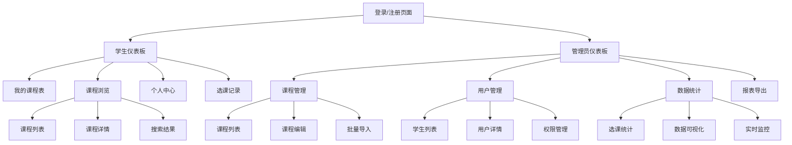
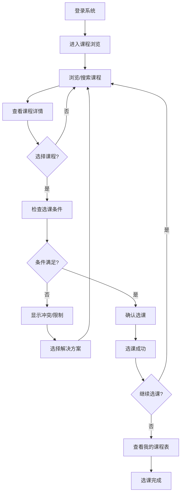
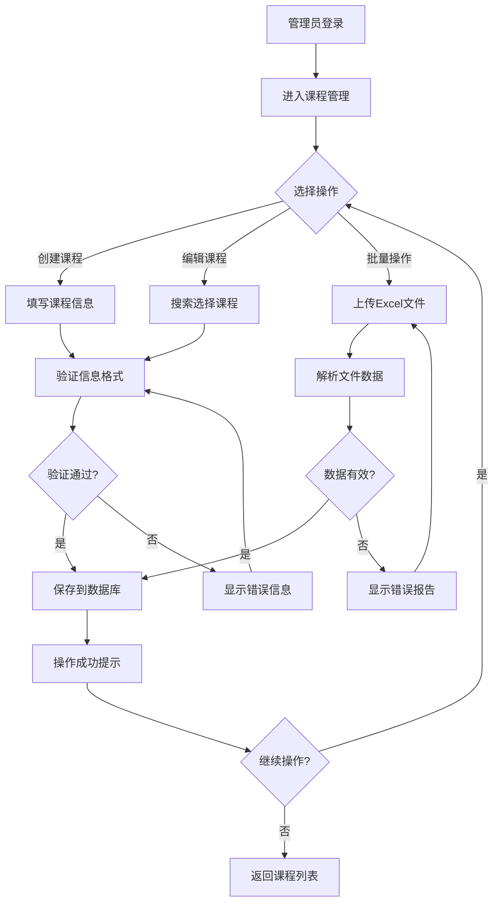

# 大学生在线选课系统 UI/UX 规范

## 介绍

本文档定义了大学生在线选课系统的用户体验目标、信息架构、用户流程和视觉设计规范。它作为视觉设计和前端开发的基础，确保提供一致性和以用户为中心的体验。

### 整体UX目标与原则

#### 目标用户画像

**主要用户画像：在校大学生**
- 18-25岁，数字原生代，熟悉技术操作
- 时间敏感，选课期间压力较大
- 期望快速、直观的操作体验
- 需要清晰的视觉反馈和状态提示

**次要用户画像：教务管理人员**
- 25-45岁，熟悉传统办公软件
- 注重数据的准确性和完整性
- 需要高效的管理工具
- 偏好结构化的信息展示

#### 可用性目标

- **易学性**: 新用户能在5分钟内完成核心选课操作
- **使用效率**: 熟练用户能在2分钟内完成完整选课流程
- **错误预防**: 关键操作提供明确的确认和验证
- **可记忆性**: 用户在选课高峰期也能快速找到所需功能

#### 设计原则

1. **清晰优于巧思** - 优先考虑清晰的信息传达而非复杂的交互设计
2. **渐进式披露** - 只在需要时显示相关信息，避免信息过载
3. **一致性模式** - 在整个应用中使用熟悉的UI模式
4. **即时反馈** - 每个操作都应有清晰、即时的响应
5. **默认可访问** - 从一开始就为所有用户设计

### 变更日志

| 日期 | 版本 | 描述 | 作者 |
|------|------|------|------|
| 2025-12-15 | v1.0 | 初始UI/UX规范版本 | Sally (UX Expert) |

## 信息架构 (IA)

### 站点地图 / 屏幕清单

### 导航结构

**主导航:**
- **学生侧**: 仪表板、课程浏览、我的课程表、个人中心
- **管理员侧**: 仪表板、课程管理、用户管理、数据统计、系统设置

**次级导航:**
- **课程浏览**: 课程列表、搜索、筛选、收藏
- **用户管理**: 学生列表、搜索、批量操作、权限设置

**面包屑策略:**
- 显示用户当前位置和返回路径
- 在多层级页面中提供清晰的导航层次
- 主页面不显示面包屑

## 用户流程

### 学生选课流程

**用户目标:** 学生能够快速、准确地完成课程选择，避免时间冲突和不符合要求的课程

**入口点:** 登录后点击"课程浏览"或直接搜索课程

**成功标准:** 学生在3分钟内完成选课，系统正确检测并处理所有冲突

#### 流程图

#### 边缘情况和错误处理

- **时间冲突**: 显示具体的冲突时间和课程，建议替代方案
- **先修要求未满足**: 显示缺失的先修课程，提供相关课程链接
- **课程已满**: 提供候补选项或相似课程推荐
- **网络中断**: 保存选草稿，恢复时提示未完成的操作
- **重复选课**: 明确提示已选课程，避免误操作

**注意事项:** 选课高峰期需要考虑并发处理和实时状态更新

### 管理员课程管理流程

**用户目标:** 管理员能够高效地创建、编辑和管理课程信息，确保数据的准确性和完整性

**入口点:** 管理员登录后进入"课程管理"模块

**成功标准:** 管理员在5分钟内完成单个课程的信息更新，批量操作准确无误

#### 流程图

## 线框图和模型

### 设计文件位置

**主要设计文件:** 将在Figma中创建高保真原型和设计系统

### 关键屏幕布局

#### 登录页面

**目的:** 提供安全、简洁的用户认证入口

**关键元素:**
- 学校Logo和系统名称
- 用户类型选择（学生/管理员）
- 学号/邮箱输入框
- 密码输入框（显示/隐藏密码选项）
- 记住登录状态复选框
- 登录按钮和忘记密码链接

**交互注意事项:**
- 表单验证在输入时实时进行
- 登录按钮在输入完成前保持禁用状态
- 错误提示在输入框下方显示

#### 课程列表页面

**目的:** 让学生快速浏览和筛选可选课程

**关键元素:**
- 搜索栏（支持课程名称、教师、关键词搜索）
- 高级筛选面板（时间、学分、学院等）
- 课程卡片网格布局
- 分页或无限滚动
- 课程状态标签（可选、已满、已选等）

**交互注意事项:**
- 筛选条件变化时，结果实时更新
- 课程卡片hover时显示快捷操作按钮
- 选中课程后更新其他相关课程的状态

#### 课程详情模态框

**目的:** 展示完整课程信息，支持选课操作

**关键元素:**
- 课程基本信息（名称、代码、学分、教师）
- 上课时间和地点
- 课程描述和先修要求
- 剩余名额和选课状态
- 选课/退课操作按钮
- 相关课程推荐

**交互注意事项:**
- 模态框背景可点击关闭
- 选课操作前进行条件验证
- 操作后立即更新状态和提示

## 组件库 / 设计系统

### 设计系统方法

**设计系统方法:** 采用Ant Design作为基础UI组件库，结合自定义主题和教育场景优化，创建统一的设计语言

### 核心组件

#### 课程卡片 (CourseCard)

**目的:** 展示课程基本信息，支持快速操作

**变体:**
- 列表视图：紧凑布局，适合信息对比
- 网格视图：图片优先，适合浏览
- 详情视图：完整信息，适合决策

**状态:**
- 默认状态：可选课程
- 已选状态：用户已选择
- 已满状态：课程名额已满
- 冲突状态：时间或条件冲突

**使用指南:**
- 在课程列表和搜索结果中使用
- 保持卡片信息层次清晰
- 提供一致的交互反馈

#### 时间表视图 (TimetableView)

**目的:** 以周历形式展示用户课程安排

**变体:**
- 周视图：显示完整一周安排
- 日视图：显示单日详细安排
- 月视图：显示月度概览

**状态:**
- 课程时段：已选择的课程
- 空闲时段：可选时间段
- 冲突时段：时间冲突提醒

**使用指南:**
- 在"我的课程表"页面使用
- 支持拖拽调整选课（未来功能）
- 清晰显示课程时间和地点

#### 搜索筛选面板 (SearchFilter)

**目的:** 提供多维度的课程搜索和筛选功能

**变体:**
- 简单搜索：单个搜索框
- 高级搜索：多条件组合
- 侧边筛选：固定侧边栏

**状态:**
- 默认状态：显示常用筛选条件
- 展开状态：显示所有高级选项
- 应用状态：显示当前选中的筛选条件

**使用指南:**
- 在课程浏览页面使用
- 支持筛选条件的保存和重置
- 提供实时的筛选结果更新

## 品牌与风格指南

### 视觉识别

**品牌指南:** 采用现代化、教育主题的设计风格，体现专业性和易用性

### 色彩方案

| 颜色类型 | 十六进制代码 | 用途 |
|----------|--------------|------|
| Primary | #1890ff | 主要按钮、链接、强调元素 |
| Secondary | #722ed1 | 次要操作、标签、装饰元素 |
| Accent | #13c2c2 | 特殊状态、成功操作 |
| Success | #52c41a | 成功反馈、确认信息 |
| Warning | #faad14 | 警告提示、注意事项 |
| Error | #f5222d | 错误信息、危险操作 |
| Neutral | #8c8c8c | 辅助文本、边框、背景 |

### 字体设计

#### 字体族

- **主要字体:** -apple-system, BlinkMacSystemFont, 'Segoe UI', Roboto, sans-serif
- **次要字体:** 'Helvetica Neue', Arial, sans-serif
- **等宽字体:** 'Fira Code', 'SF Mono', Consolas, monospace

#### 字体比例

| 元素 | 大小 | 粗细 | 行高 |
|------|------|------|------|
| H1 | 32px | 600 | 1.2 |
| H2 | 24px | 600 | 1.3 |
| H3 | 20px | 600 | 1.4 |
| Body | 14px | 400 | 1.5 |
| Small | 12px | 400 | 1.4 |

### 图标设计

**图标库:** Ant Design Icons + 自定义教育场景图标

**使用指南:**
- 保持图标风格的一致性
- 为图标提供明确的语义含义
- 在重要操作旁使用图标增强识别度

### 间距与布局

**网格系统:** 24px基础网格系统，使用8px作为最小间距单位

**间距比例:** 4px, 8px, 16px, 24px, 32px, 48px, 64px

## 可访问性要求

### 合规目标

**标准:** WCAG AA级别，确保系统对所有用户（包括残障人士）的可用性

### 关键要求

**视觉方面:**
- 颜色对比度: 文本与背景对比度至少4.5:1
- 焦点指示器: 所有可交互元素有清晰的焦点状态
- 文本大小: 支持浏览器缩放至200%而不影响功能

**交互方面:**
- 键盘导航: 所有功能可通过键盘完成操作
- 屏幕阅读器: 提供合适的ARIA标签和语义化标记
- 触摸目标: 移动设备上触摸目标至少44px×44px

**内容方面:**
- 替代文本: 为所有图片和图标提供描述性alt文本
- 标题结构: 使用逻辑的标题层次结构
- 表单标签: 所有表单元素都有明确的标签

### 测试策略

- 使用自动化工具（axe-core）进行基础可访问性检测
- 定期进行键盘导航和屏幕阅读器测试
- 邀请残障用户参与可用性测试
- 在开发过程中持续监控可访问性合规

## 响应式策略

### 断点设置

| 断点 | 最小宽度 | 最大宽度 | 目标设备 |
|------|----------|----------|----------|
| Mobile | 320px | 767px | 智能手机 |
| Tablet | 768px | 1023px | 平板设备 |
| Desktop | 1024px | 1439px | 笔记本电脑 |
| Wide | 1440px | - | 台式显示器 |

### 适配模式

**布局变化:**
- 移动端：单列布局，卡片堆叠显示
- 平板端：双列布局，优化触控操作
- 桌面端：多列布局，充分利用屏幕空间

**导航变化:**
- 移动端：汉堡菜单，底部导航栏
- 平板端：侧边导航栏，可折叠
- 桌面端：顶部导航栏 + 侧边导航栏

**内容优先级:**
- 移动端：优先显示核心功能（课程列表、选课操作）
- 平板端：显示中等详细信息
- 桌面端：显示完整信息和操作

**交互变化:**
- 移动端：优化触控操作，增加间距
- 平板端：兼顾触控和鼠标操作
- 桌面端：优化鼠标操作和键盘快捷键

## 动画与微交互

### 动画原则

- **功能性优先**: 动画必须服务于功能，不能干扰用户操作
- **性能考虑**: 确保动画流畅，不影响页面性能
- **可访问性**: 尊重用户的动画偏好设置
- **一致性**: 相同类型的交互使用相似的动画效果

### 关键动画

- **页面转场:** 淡入淡出效果（300ms, ease-in-out）
- **卡片hover:** 轻微上移和阴影变化（200ms, ease-out）
- **加载状态:** 骨架屏加载效果（800ms循环）
- **成功反馈:** 绿色勾选动画（400ms, ease-out）
- **错误提示:** 红色抖动动画（300ms, ease-in-out）
- **模态框:** 从中心缩放进入（250ms, ease-out）

## 性能考虑

### 性能目标

- **页面加载:** 首屏加载时间小于3秒
- **交互响应:** 用户操作反馈时间小于200ms
- **动画帧率:** 保持60fps的流畅动画

### 设计策略

- **图片优化:** 使用适当的图片格式和尺寸
- **组件懒加载:** 对非首屏内容实施懒加载
- **CSS优化:** 使用CSS变量和模块化样式
- **字体加载:** 使用字体显示策略，避免FOUT
- **动画性能:** 使用transform和opacity属性优化动画性能

## 下一步

### 即时行动

1. 与开发团队评审UI/UX规范，确保技术可行性
2. 在Figma中创建高保真原型和设计系统
3. 进行用户测试，验证设计方案的可用性
4. 准备与设计架构师的前端架构交接

### 设计交接检查清单

- [ ] 所有用户流程已文档化
- [ ] 组件清单完整
- [ ] 可访问性要求已定义
- [ ] 响应式策略明确
- [ ] 品牌指导原则已整合
- [ ] 性能目标已建立

## 检查表结果

（此部分将在运行UI/UX检查表后填充）